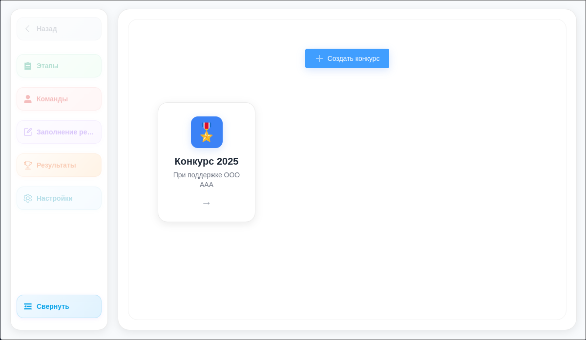
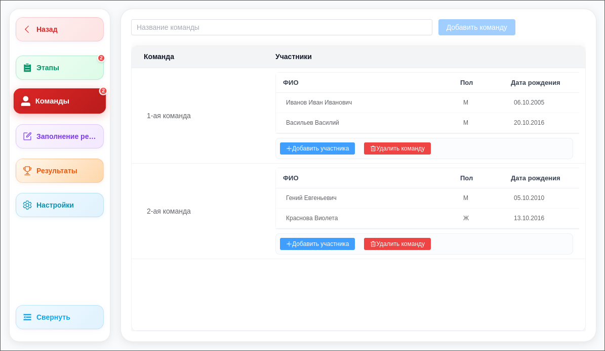
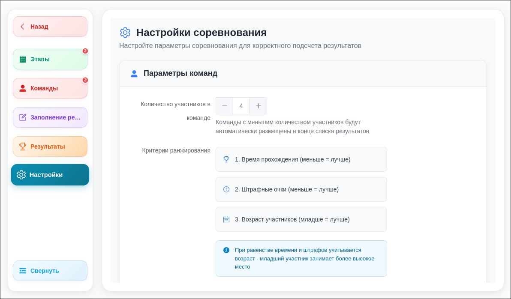
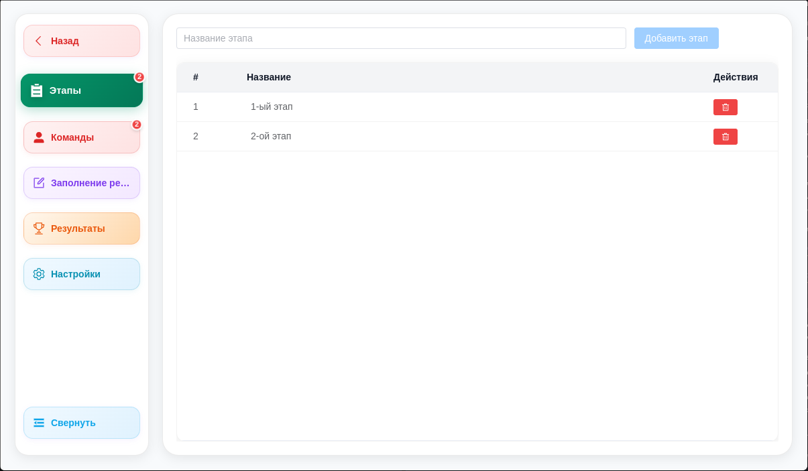
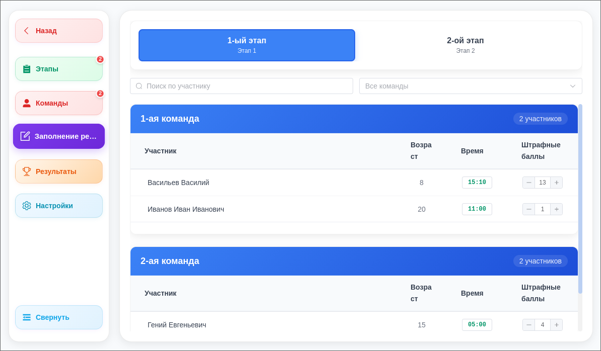
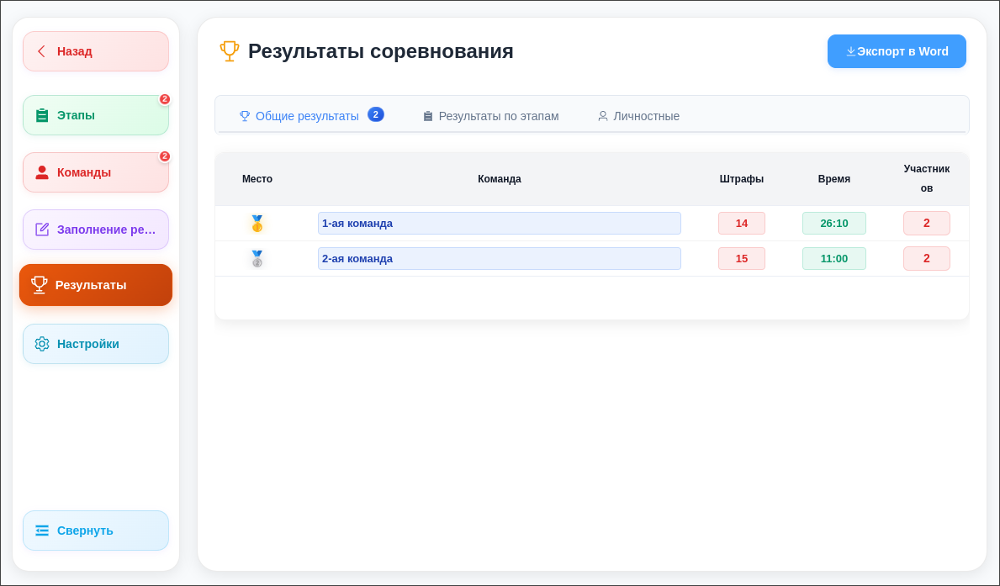

# SafeWheel 🏆

**SafeWheel** — это десктопное приложение для управления конкурсами "Безопасное колесо" и другими соревнованиями. Приложение построено на Electron с современным веб-интерфейсом на Vue.js и использует SQLite для хранения данных.

## 🚀 Основные возможности

- **Управление конкурсами** — создание и настройка различных соревнований
- **Управление командами и участниками** — добавление команд и участников к конкурсам
- **Этапы соревнований** — создание и настройка этапов конкурса
- **Ввод результатов** — удобный интерфейс для ввода результатов по этапам
- **Таблицы результатов** — автоматический подсчет и отображение результатов
- **Экспорт в Word** — генерация отчетов в формате .docx
- **Кроссплатформенность** — работает на Windows, Linux

## 📸 Скриншоты

### Главный экран приложения



### Управление конкурсами



### Команды и участники



### Этапы соревнований



### Ввод результатов



### Результаты и рейтинги



## 🛠 Технологический стек

### Backend

- **Electron** — фреймворк для создания десктопных приложений
- **Node.js** — серверная среда выполнения
- **SQLite (better-sqlite3)** — встроенная база данных
- **docx** — генерация Word документов

### Frontend

- **Vue.js 3** — прогрессивный JavaScript фреймворк
- **Element Plus** — UI библиотека компонентов
- **Vite** — быстрый инструмент сборки
- **Axios** — HTTP клиент для API запросов

## 📦 Установка и запуск

### Требования

- Node.js 18+
- npm

### Установка зависимостей

```bash
# Установка зависимостей
npm install
```

## 🎯 Основные функции

### 1. Управление конкурсами

- Создание новых конкурсов с настройкой названия, описания и эмодзи
- Просмотр списка всех конкурсов
- Выбор активного конкурса для работы

### 2. Команды и участники

- Добавление команд к конкурсу
- Регистрация участников в командах
- Управление информацией об участниках

### 3. Этапы соревнований

- Создание этапов конкурса
- Настройка параметров каждого этапа
- Управление порядком этапов

### 4. Ввод результатов

- Удобный интерфейс для ввода результатов по этапам
- Поддержка различных типов результатов
- Валидация введенных данных

### 5. Результаты и рейтинги

- Автоматический подсчет общих результатов
- Таблицы результатов по этапам
- Рейтинги участников и команд

### 6. Экспорт данных

- Генерация отчетов в формате Word (.docx)
- Экспорт результатов и рейтингов
- Настраиваемые шаблоны отчетов


## 🎯 Сборка проекта для разных платформ

```bash
# Сборка для Linux
npm run build:linux

# Сборка для Windows
npm run build:win
```

После успешной сборки вы получите готовое к использованию приложение с современным интерфейсом, как показано на скриншотах выше!

